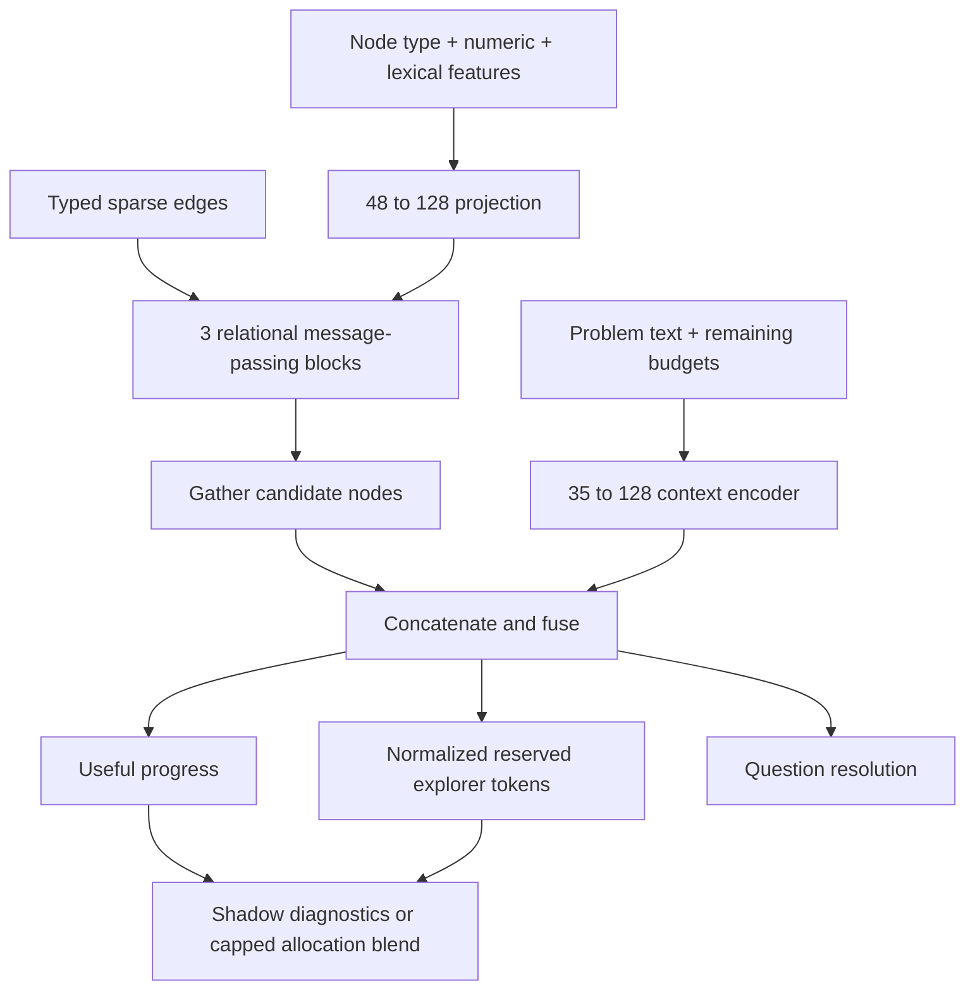

# MARE v0.6: experimental graph research planner

This release implements the first proposed component: a problem-conditioned research scheduler, offline training, controlled benchmarks, and a web/worker adapter. It does not implement a universal model designer, automatic paper-to-code generation, a new language model, or a learned theorem verifier.

## Run the experiments

From the extracted project directory, using Python 3.12:

```bash
python3.12 -m venv .venv
source .venv/bin/activate
pip install -c requirements.lock -e '.[dev,planner]'
python -m mare_planner.cli benchmark --task context --out results/context
python -m mare_planner.cli benchmark --task dependencies --out results/dependencies
pytest -q
```

The optional planner dependency is PyTorch (tested with 2.14.0, CPU on macOS arm64). On Linux, avoid downloading CUDA dependencies for CPU-only use by installing `torch==2.14.0` from `https://download.pytorch.org/whl/cpu` first, then installing the project extras. GPU execution has not been tested. Benchmark runs train three seeded graph models and three matching models with edges removed, plus NumPy TinyMLP baselines. They write datasets, checkpoints, split IDs, per-problem outcomes, and metrics. Checkpoints are local tensor state dictionaries loaded with `weights_only=True`, not arbitrary uploaded Python.

## Architecture and interface

`mare_planner/network.py` is the executable model. Defaults: width 128, depth 3, 831,747 trainable parameters. Five node types: branches, questions, claims, evidence, failures. Each node has 48 features: five type indicators, eleven numeric slots, and 32 signed lexical hash features. The problem context has 35 features: 32 lexical hashes plus remaining model-call, tool-call, and round fractions. Hashing is deterministic and offline; it is not a semantic language encoder.

Seven directed relation families have separate forward and reverse weights: parent, contains, asks, requires, supports, contradicts, failure. Each block transforms source-node messages by relation, averages incoming messages, and applies a residual update with GELU and LayerNorm. Candidate-node representations combine with the problem/budget encoder, then feed three independently parameterized sigmoid heads.



Variable-size graphs are batched by offsetting node/edge indices, with no dense adjacency matrix or padding nodes. Capture refuses graphs over 2,048 nodes instead of silently dropping evidence. Records retain at most 100 rounds per run. Large-scale throughput, accelerator performance, and multi-tenant operation are not validated.

The uploaded DNN Designer informed the graph-block/plugin approach. Its original archive was not modified. This release uses a dedicated sparse PyTorch implementation because the designer's dense blocks and standard shared-target training loop do not directly represent these datasets and independent labels. There is no claim that this model has been imported or trained inside the designer UI.

## Recording real engine decisions

```bash
python -m mare_planner.cli collect-demo --rounds 2 --out demo.json
python -m mare_planner.cli export demo.json --out demo.jsonl
```

The mock example tests plumbing only. Real runs can be captured by setting `MARE_PLANNER_CAPTURE=true` on the worker. Use the web run's Export button, then the export command above. The run checkpoint carries traces; round recovery preserves them. Identical canonical problem specifications share a split key even across different run IDs. Paraphrased or closely related problems still require manual family grouping to prevent leakage.

Snapshots precede exploration and contain all eligible candidates and the affordable scheduled set. Inclusion values are 0 or 1 for this deterministic set, conditional on the state; they are **not randomized exploration propensities**. Unselected and budget-skipped candidates have missing labels, not zero rewards. These observational records do not support unbiased off-policy evaluation. Synthesis is a shared downstream operation, so branch-level reward attribution remains approximate.

Utility rewards newly verified/formalized claims, reproducible contradictory counterexample evidence, and answered questions. A rejected proposal alone earns no counterexample reward. The engine's recorded evidence status supplies the label; it is not independently upgraded into a theorem guarantee. Resolution is a separate observed binary label.

Cost uses **reserved explorer output tokens**, normalized as `units / (1 + units)`, where one unit is 4,000 reserved tokens. It is not dollars, actual input/output usage, wall time, or full verification/synthesis cost. It is attributed to scheduled branch/question tasks. The existing engine's `compute_spent` counter counts claims, so it is deliberately not used as a financial or physical-compute label.

## Training and evaluation

Concatenate exported JSONL records from at least ten distinct problems, then run:

```bash
python -m mare_planner.cli train research.jsonl --out research-planner.pt --epochs 50 --seed 7
```

Training uses AdamW, per-head masked MSE, gradient clipping, validation checkpoint selection, and early stopping. Splits are by problem (60/20/20), not by individual rounds. Metadata includes feature/label versions, dataset digest, seed, split IDs, training history, and held-out head errors. The three heads are bounded estimates; probability calibration has not been established. Cross-problem out-of-distribution detection is not implemented.

## Enable shadow mode in the web worker

After installing the planner extra, set these values in `.env` and restart the worker:

```dotenv
MARE_PLANNER_CAPTURE=true
MARE_PLANNER_MODE=shadow
MARE_PLANNER_CHECKPOINT=/absolute/path/to/artifacts/benchmark-dependencies/planner-seed-7.pt
```

The Neural Policy page displays recording status, mode, checkpoint digest, and predictions. The included seed-7 checkpoint is a reproducible example, not a best-test-score selection. It is trained only on synthetic branch examples; question predictions in the UI demonstration are out of distribution and must not guide research.

Shadow mode retains the existing heuristic/tiny-network policy. No model means recording plus fallback. Missing/corrupt/incompatible models fall back with a visible reason. A checkpoint digest is pinned in the state: replacing it on resume causes fallback. Feature changes require a new schema version.

`MARE_PLANNER_MODE=blend` is an explicit operator choice, capped at 25% (or the lower existing policy cap). Synthetic/mock/mixed-source checkpoints are refused for blending. A `source=real` metadata value is a provenance label, not a certification or security boundary. Keep artifacts operator-controlled and review held-out/prospective outcomes before selecting blend mode. There is no automatic model promotion. Model inference cannot alter claim status, evidence, proof closure, or verifier acceptance.

## Containers

Default Compose remains dependency-light and can record traces without PyTorch. An optional CPU worker image configuration is included:

```bash
docker compose -f docker-compose.yml -f deploy/planner.compose.yml up --build -d
```

This mounts bundled synthetic checkpoints read-only and enables shadow mode. It uses its own v0.6 project/image names so it does not overwrite v0.5 containers or volumes. If v0.5 already owns port 8080, set `MARE_WEB_PORT=8086`. The v0.6 planner container build has not been executed locally; CPU package retrieval and Linux runtime remain unverified in this release. Native SQLite/worker/API execution was tested.

## Paper provenance and the next experiment

The existing MARE literature/evidence pipeline is retained. No paper ingestion service from the uploaded designer is exposed through the public API. A future paper-assisted design should record the exact source passage, assumptions, chosen equation/loss, reproduction test, and control experiment before becoming a model plugin.

Relevant foundations: [Graph Attention Networks](https://arxiv.org/abs/1710.10903) motivates graph-local attention; this implementation instead uses relation-specific mean messages, not GAT coefficients. [PyTorch serialization guidance](https://docs.pytorch.org/docs/2.14/notes/serialization.html) informs tensor-only loading. Neither reference demonstrates that this planner improves mathematical research.

The next scientific step is collecting varied real problem trajectories and running prospective, budget-matched experiments against both the original scheduler and the problem-conditioned model with edges removed. The current synthetic results justify that test, not production promotion.
